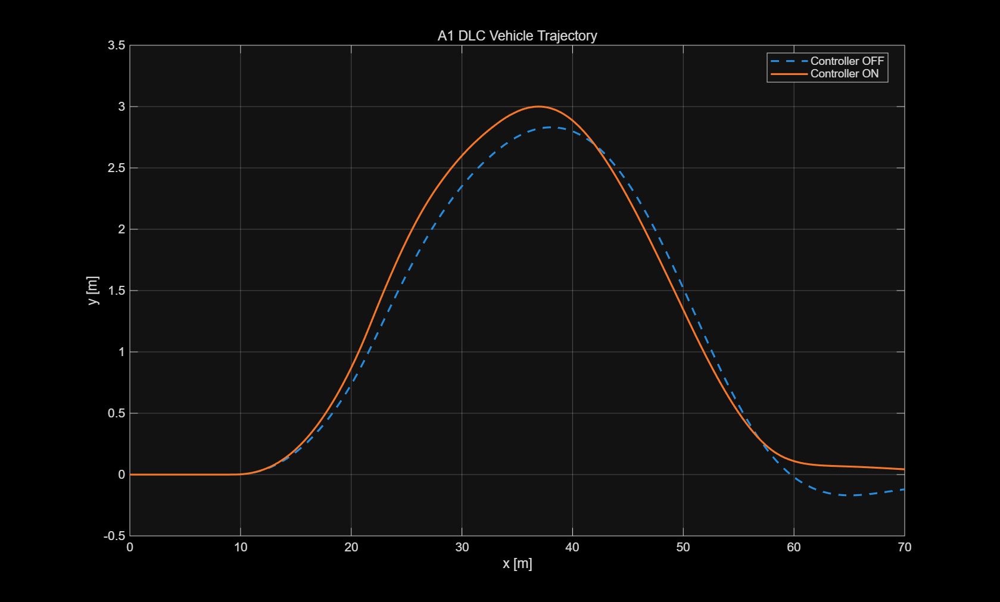
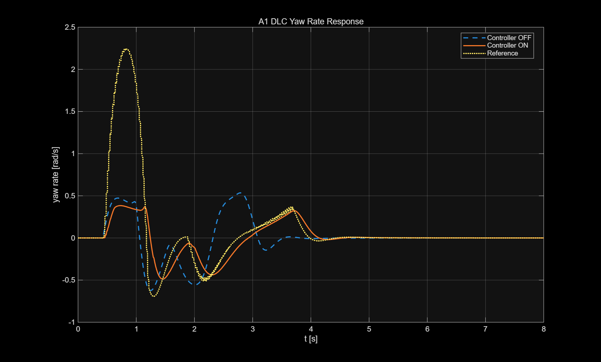
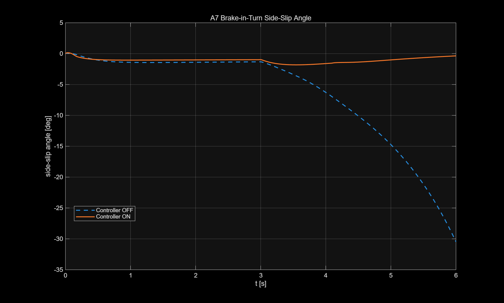
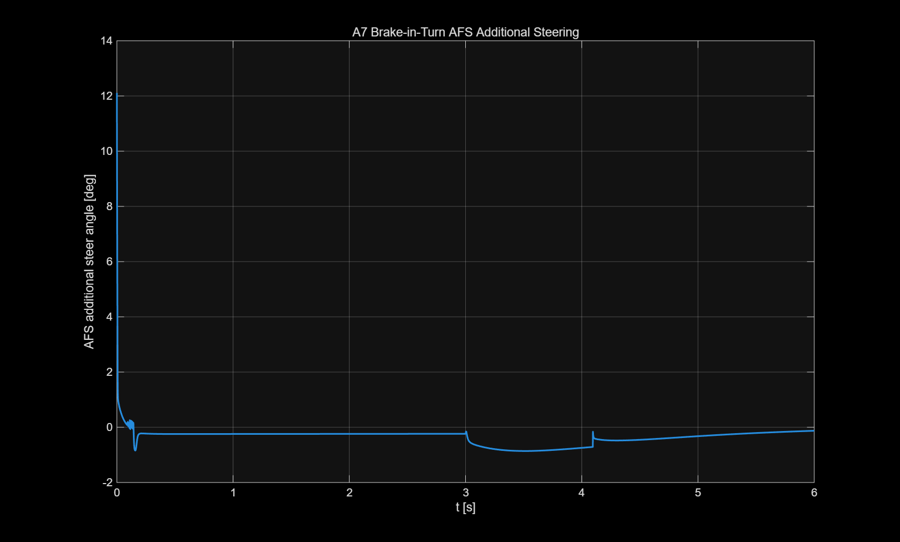

# [202220965-권순호] ICC 제어기 설계 보고서

**과목**: 자동제어 | 2026 봄
**제출일**: 2026-06-23
**팀**: 개인

---

## 1. 설계 개요 (1 페이지)

본 프로젝트의 목표는 차량의 횡방향, 종방향 및 수직 방향 거동을 통합적으로 제어하여 다양한 주행 조건에서 안정성과 주행 성능을 개선하는 것이다. 평가에는 Step Steer, Double Lane Change, 정상상태 원선회, Brake-in-Turn, 직선 급제동 및 제동이 포함된 차선 변경 시나리오가 사용되었다. 따라서 특정 시나리오 하나의 성능만 높이기보다는 서로 다른 주행 조건에서 차량의 안정성을 유지하면서 전체 KPI를 균형 있게 개선하는 것을 설계 목표로 설정하였다.

횡방향 제어에는 AFS(Active Front Steering)와 ESC(Electronic Stability Control)를 결합하였다. AFS는 목표 yaw rate와 실제 yaw rate의 오차를 기반으로 추가 조향각을 생성하며, 기본 제어 구조로 PID 제어를 사용하였다. 고정된 하나의 PID 게인만 사용할 경우 Step Steer에서는 빠른 응답과 낮은 overshoot를 동시에 만족하기 어려웠고, Double Lane Change에서는 경로 추종과 차체 안정성 사이의 상충관계가 발생하였다. 이를 보완하기 위해 차량 속도와 목표 yaw rate의 변화 상태에 따라 제어 게인을 조절하는 gain scheduling 방식을 적용하였다. 또한 차체 슬립각이 설정한 임계값을 넘을 경우 ESC가 추가 yaw moment를 발생시키도록 하여 과도한 횡미끄러짐과 스핀을 억제하였다.

종방향 제어에는 목표 속도와 실제 속도의 오차를 이용한 PI 제어를 적용하였다. PI 제어기의 출력으로 요구 종가속도를 계산한 뒤 차량 질량을 이용하여 요구 종방향 힘으로 변환하였다. 급제동 상황에서는 휠 슬립이 기준값 이상으로 증가할 경우 제동 명령을 감소시키는 간단한 ABS 로직을 적용하였다. 또한 제동력의 급격한 변화를 방지하기 위해 force-rate limit을 적용하여 jerk가 과도하게 증가하지 않도록 하였다.

수직 방향 제어에는 Skyhook 개념을 단순화한 CDC(Continuous Damping Control)를 적용하였다. 차체와 비현가질량 사이의 상대속도 부호에 따라 각 휠의 감쇠계수를 최소값과 최대값 사이에서 전환하여 차체의 상하 운동을 줄이도록 하였다. ctrl_coordinator에서는 AFS가 생성한 추가 조향각을 제한 범위 내에서 최종 조향 명령으로 전달하고, 종방향 제동 요구와 ESC yaw moment를 네 바퀴의 제동 토크로 분배하였다.

최종 설계에서는 속도와 운전 상태에 따른 gain scheduling을 핵심 기법으로 사용하였다. 저속에서는 조향 명령이 과도하게 증가하지 않도록 전체 제어 이득을 낮추고, 고속에서는 횡방향 안정성을 확보할 수 있도록 이득을 증가시켰다. 또한 목표 yaw rate가 급변하는 초기 과도구간, 큰 Step 명령이 유지되는 구간, 정상상태 원선회 구간을 구분하여 서로 다른 PID 게인을 적용하였다. 이러한 구조를 통해 하나의 고정 게인으로 모든 시나리오를 제어할 때 발생했던 overshoot 증가와 정상상태 성능 저하를 완화하였다.

각 제어기의 역할은 다음과 같다.

- ctrl_lateral: PID 기반 AFS를 통해 yaw rate를 추종하고, 슬립각이 임계값을 넘으면 ESC yaw moment를 생성한다. 차량 속도와 목표 yaw rate의 변화 상태에 따라 제어 이득을 조절한다.
- ctrl_longitudinal: 속도 오차 기반 PI 제어를 통해 요구 종방향 힘을 계산하고, 휠 슬립이 커지면 제동력을 제한한다.
- ctrl_vertical: 각 휠의 서스펜션 상대속도를 이용하여 CDC 감쇠계수를 결정한다.
- ctrl_coordinator: 추가 조향각을 제한하고, 기본 제동 요구와 ESC yaw moment를 네 바퀴의 제동 토크로 분배한다.

최종 로컬 자동채점 결과는 57.19/70점이었다. A3 Step Steer에서는 yaw-rate overshoot가 2.2509%, rise time이 0.2340 s로 두 항목 모두 만점을 받았다. Settling time은 0.8100 s로 목표인 0.8 s를 소폭 초과했지만 3.95/4점을 획득했다. A1과 D1에서는 side-slip과 LTR 기준을 만족했으나, 최대 경로 이탈은 각각 1.5533 m로 목표값보다 크게 나타났다.

B1 직선 급제동의 정지거리는 50.6039 m로 측정되었다. 로컬 채점기에는 기존 목표인 40 m가 표시되어 2.35/5점으로 계산되지만, 2026년 6월 22일 공지에서 최종 만점 기준이 66.5 m 이하로 변경되었다. 따라서 최종 채점에서는 정지거리 기준을 만족할 것으로 판단된다. 반면 absSlipRMS는 0.7674로 목표인 0.1을 만족하지 못했으며, 정지거리 확보와 휠 슬립 억제 사이의 상충관계가 남아 있다.

설계 과정에서는 응답 속도를 높이기 위해 AFS 게인을 증가시키면 overshoot 및 다른 시나리오의 경로 이탈이 증가하고, 제동 토크를 과도하게 높이면 휠 슬립과 횡방향 안정성이 악화되는 상충관계가 나타났다. 이에 따라 개별 KPI의 최대화보다 전체 시나리오에서 안정적인 성능을 확보하도록 최종 게인과 제한값을 결정하였다.

---

## 2. 수학적 모델링 (1-2 페이지)

### 2.1 사용한 plant 단순화
최종 시뮬레이션에는 차체의 횡방향, 종방향, 수직 방향 운동과 각 휠의 거동을 포함한 14-DOF 차량 모델이 사용된다. 따라서 yaw, roll, pitch뿐 아니라 휠 회전, 서스펜션 변위, 타이어 종·횡력까지 함께 반영된다. 실제 평가도 이 모델에서 이루어지기 때문에, 단순한 제어기라도 여러 운동이 서로 영향을 주는 상황에서 동작해야 한다.

다만 제어기 설계 단계에서 14-DOF 모델 전체를 그대로 사용하면 상태변수와 파라미터가 지나치게 많아진다. 각 게인이 차량 거동에 어떤 영향을 주는지 파악하기도 어려워진다. 그래서 횡방향 제어는 2-DOF bicycle model을 기준으로 생각했고, 종방향 제어는 차량 전체를 하나의 질량으로 보는 단순 모델을 사용했다. 수직 방향은 각 휠에서 차체와 비현가질량 사이의 상대속도를 이용하는 Skyhook 방식으로 접근했다.

즉, 설계 자체는 해석하기 쉬운 단순 모델 위에서 진행하고, 최종 성능은 더 복잡한 14-DOF plant에서 확인하는 구조이다. 이 방식은 이론적으로 완전히 정밀한 모델은 아니지만, 각 제어기의 역할을 분리해서 이해하고 게인을 조정하는 데에는 충분하다고 판단했다.

### 2.2 횡방향 bicycle model

횡방향 제어기 설계에서는 좌우 바퀴를 각각 하나의 등가 전륜과 후륜으로 합친 bicycle model을 사용했다. 차량의 종방향 속도 $(V_x)$가 일정하고, 조향각과 타이어 슬립각이 크지 않다고 가정하면 횡방향 힘 평형과 yaw moment 평형은 다음과 같이 쓸 수 있다.
$$
m(\dot{v}y + V_x r) = F{yf} + F_{yr}
$$

$$
I_z \dot{r} = l_f F_{yf} - l_r F_{yr} + M_z
$$

여기서 $v_y$는 차량 무게중심의 횡속도, $r$은 yaw rate이다. $F_{yf}$, $F_{yr}$은 전륜과 후륜의 횡력이고, $M_z$는 ESC가 추가로 만드는 yaw moment이다. $l_f$와 $l_r$은 차량 무게중심에서 각각 전륜축과 후륜축까지의 거리이다.
타이어가 선형 영역에서 동작한다고 보면 횡력은 슬립각에 비례한다고 둘 수 있다.

$$
F_{yf}
=
C_f
\left(
\delta-\frac{v_y+l_f r}{V_x}
\right)
$$

$$
F_{yr}
=
C_r
\left(
-\frac{v_y-l_r r}{V_x}
\right)
$$

$C_f$와 $C_r$은 전륜과 후륜의 등가 코너링 강성이고, $delta$는 전륜 조향각이다. 이 식을 차량 운동방정식에 대입하면 횡속도와 yaw rate에 대한 상태방정식을 얻을 수 있다.

상태변수는 다음과 같이 두었다.

$$
x=
\begin{bmatrix}
v_y\\
r
\end{bmatrix}
$$

입력은 전륜 조향각 $delta$와 ESC yaw moment $M_z$이다.

$$
\dot{x}
=
Ax+B_{\delta}\delta+B_M M_z
$$

각 상태방정식은 다음과 같다.

$$
\begin{aligned}
\dot{v}_y
&=
-\frac{C_f+C_r}{mV_x}v_y
+
\left(
\frac{l_rC_r-l_fC_f}{mV_x}
-
V_x
\right)r
+
\frac{C_f}{m}\delta
\\[4pt]
\dot{r}
&=
\frac{l_rC_r-l_fC_f}{I_zV_x}v_y
-
\frac{l_f^2C_f+l_r^2C_r}{I_zV_x}r
+
\frac{l_fC_f}{I_z}\delta
+
\frac{1}{I_z}M_z
\end{aligned}
$$

따라서 상태행렬과 입력행렬은 다음과 같이 정리된다.

$$
A=
\begin{bmatrix}
-\frac{C_f+C_r}{mV_x}
&
\frac{l_rC_r-l_fC_f}{mV_x}-V_x
\\[8pt]
\frac{l_rC_r-l_fC_f}{I_zV_x}
&
-\frac{l_f^2C_f+l_r^2C_r}{I_zV_x}
\end{bmatrix}
$$

$$
B_{\delta}
=
\begin{bmatrix}
\frac{C_f}{m}
\\[6pt]
\frac{l_fC_f}{I_z}
\end{bmatrix}
\qquad
B_M
=
\begin{bmatrix}
0
\\[4pt]
\frac{1}{I_z}
\end{bmatrix}
$$

AFS 제어에서는 yaw rate 추종이 핵심이므로 출력은 다음과 같이 둘 수 있다.

$$
y=
\begin{bmatrix}
0 & 1
\end{bmatrix}x
=
r
$$

차체 슬립각은 작은 각도 범위에서 다음과 같이 근사했다.

$$
\beta
\approx
\frac{v_y}{V_x}
$$

실제 코드에서는 목표 yaw rate와 실제 yaw rate의 오차를 이용해 추가 조향각을 계산하고, $|\beta|$가 설정한 기준보다 커지면 ESC가 yaw moment를 발생시키도록 구성했다. 따라서 bicycle model은 AFS와 ESC의 역할을 나누어 이해하는 기준 모델로 사용되었다.

### 2.3 종방향 모델

종방향 제어에서는 차량 전체를 하나의 질량으로 단순화했다. 종방향 합력 $(F_x)$와 차량 속도 $(V_x)$의 관계는 다음과 같다.

$$
m\dot{V}_x = F_x
$$

목표 속도와 실제 속도의 오차는 다음과 같이 정의했다.

$$
e_v = V_{x,\mathrm{ref}} - V_x
$$

코드에서는 이 속도 오차를 PI 제어기에 입력하여 요구 종가속도를 계산한다.

$$
a_x^{\ast} = K_p e_v + K_i \int e_v,dt
$$

계산된 요구 가속도에 차량 질량을 곱하면 요구 종방향 힘을 얻을 수 있다.

$$
F_x^{\ast} = m a_x^{\ast}
$$

PI 제어기의 출력이 갑자기 변하면 제동력도 급격하게 달라지고 jerk가 커질 수 있다. 이를 줄이기 위해 코드에서는 한 시점에서 다음 시점으로 넘어갈 때 종방향 힘의 변화량을 제한했다. 따라서 단순 PI 제어뿐 아니라 force-rate limit도 함께 적용한 구조이다.

급제동 상황에서는 휠 슬립을 이용하여 ABS의 개입 여부를 판단했다. 각 휠의 slip ratio는 다음과 같이 정의할 수 있다.

$$
\kappa_i = \frac{r_w\omega_i - V_x}{\max(V_x,\epsilon)}
$$

여기서 $r_w$는 타이어의 유효 반지름이고, $\omega_i$는 각 휠의 회전속도이다. $\epsilon$은 차량 속도가 매우 낮을 때 0으로 나누는 문제를 방지하기 위한 작은 양의 값이다.

제동 중에는 일반적으로 $\kappa_i$가 음수가 되므로 코드에서는 절댓값을 사용해 슬립의 크기를 판단했다. 최대 슬립이 기준값인 0.12를 넘으면 brake ratio를 줄여 휠 잠김을 완화하도록 구성했다.

### 2.4 수직 방향 모델

수직 방향 제어에는 Skyhook 개념을 단순화하여 적용했다. 각 휠 코너에서 차체의 수직속도와 비현가질량의 수직속도 차이를 서스펜션 상대속도로 정의했다.

$$
v_{\mathrm{rel},i}
=
\dot{z}_{s,i}
-
\dot{z}_{u,i}
$$

코드에서는 상대속도의 부호에 따라 감쇠계수를 최소값과 최대값 사이에서 전환한다. 상대속도가 0보다 크거나 같을 때는 다음과 같이 큰 감쇠계수를 사용한다.

$$
v_{\mathrm{rel},i} \ge 0
\quad \Rightarrow \quad
c_i = c_{\max}
$$

반대로 상대속도가 음수이면 작은 감쇠계수를 사용한다.

$$
v_{\mathrm{rel},i} < 0
\quad \Rightarrow \quad
c_i = c_{\min}
$$

이 방식은 감쇠력을 연속적으로 최적화하는 구조는 아니지만 구현이 단순하며, 차체와 휠의 상대운동 방향에 따라 감쇠력을 조절할 수 있다는 장점이 있다. 다만 감쇠계수가 두 값 사이에서 불연속적으로 전환되므로, 승차감과 타이어 접지력을 세밀하게 동시에 최적화하는 데에는 한계가 있다.

### 2.5 모델링 가정 및 한계

제어기 설계 과정에서는 다음과 같은 가정을 두었다.

* 횡방향 모델을 유도할 때 종방향 속도 (V_x)는 일정하거나 천천히 변한다고 보았다.
* 조향각과 차체 슬립각은 작은 범위에 있다고 가정했다.
* 타이어 횡력은 슬립각에 선형적으로 비례한다고 두었다.
* 좌우 바퀴를 하나의 등가 전륜과 후륜으로 묶었다.
* 공기저항, 구름저항 및 구동계의 상세 동특성은 종방향 모델에서 생략했다.
* 감쇠기 명령은 별도의 지연 없이 적용된다고 가정했다.

이러한 단순화는 제어기 구조와 게인의 영향을 이해하는 데에는 유리하지만, 큰 슬립각이나 타이어 포화가 발생하는 상황에서는 실제 차량 거동과 차이가 날 수 있다. 특히 Brake-in-Turn이나 급격한 차선 변경에서는 하중이동과 비선형 타이어 특성의 영향이 커진다.

따라서 단순 모델은 제어 구조를 정하고 게인의 조정 방향을 판단하는 데 활용했으며, 최종 성능은 여러 차량 운동이 결합된 14-DOF plant에서 검증했다.

---

## 3. 제어기 설계 (3-4 페이지)
본 프로젝트에서는 횡방향, 종방향, 수직 방향 제어기를 각각 설계한 뒤 ctrl_coordinator에서 최종 조향각과 바퀴별 제동 토크, 감쇠계수 명령을 통합했다. 하나의 제어기가 모든 차량 운동을 직접 다루도록 만들기보다는 각 운동 방향별로 역할을 분리하고, 마지막 단계에서 액추에이터 명령을 조합하는 구조를 선택했다.

제어기 게인은 이론식만으로 한 번에 결정하지 않고, 단순 모델을 통해 초기 방향을 정한 뒤 각 시나리오의 KPI 변화를 확인하면서 반복적으로 조정했다. 특히 A3 Step Steer의 응답속도와 overshoot, A1 및 D1의 경로 추종과 LTR, A7 Brake-in-Turn의 슬립각 사이에 상충관계가 컸다. 따라서 한 시나리오에서 가장 좋은 값보다는 전체 시나리오 점수가 크게 무너지지 않는 값을 최종값으로 선택했다.

### 3.1 ctrl_lateral — AFS + ESC
#### 설계 목표
횡방향 제어기는 AFS와 ESC를 함께 사용하도록 구성했다. AFS는 목표 yaw rate와 실제 yaw rate의 차이를 줄이기 위한 추가 조향각을 만들고, ESC는 차체 슬립각이 커질 때 추가 yaw moment를 발생시켜 차량의 스핀과 과도한 횡미끄러짐을 억제한다.

주요 설계 목표는 다음과 같다.

* 목표 yaw rate를 안정적으로 추종할 것
* A3 Step Steer에서 overshoot를 10% 이하로 유지할 것
* A3 settling time을 0.8 s 이하로 줄일 것
* A1과 D1에서 side-slip과 LTR을 제한할 것
* A7 Brake-in-Turn에서 차체 슬립각과 전복 위험을 줄일 것
* A4 정상상태 원선회에서는 제어기의 불필요한 개입을 최소화할 것

#### 기본 PID 제어 구조

Yaw-rate 오차는 다음과 같이 정의했다.

$$
e_r = r_{\mathrm{ref}} - r
$$

여기서 $r_{\mathrm{ref}}$는 목표 yaw rate이고, $r$은 실제 yaw rate이다.

AFS의 기본 추가 조향각은 PID 구조를 이용해 계산했다.

$$
\delta_{\mathrm{raw}}
=
K_p e_r + K_i I_r - K_d \dot{r}_f
$$

여기서 $I_r$은 yaw-rate 오차의 적분값이고, $\dot{r}_f$는 필터링된 yaw-rate 변화율이다.

일반적인 PID에서는 오차의 미분값을 사용할 수 있지만, 목표 yaw rate가 계단 형태로 변하면 derivative kick가 크게 나타날 수 있다. 이를 줄이기 위해 코드에서는 오차의 미분 대신 실제 yaw rate의 변화율을 사용했다.

$$
\dot{r}(k)
=
\frac{r(k)-r(k-1)}{\Delta t}
$$

측정된 yaw-rate 변화율은 노이즈에 민감하므로 1차 저역통과필터를 적용했다.

$$
\dot{r}_f(k)
=
\alpha_D \dot{r}_f(k-1)
+
(1-\alpha_D)\dot{r}(k)
$$

필터 계수는 다음과 같이 설정했다.

```matlab
alphaD = 0.85;
```

필터 계수를 비교적 크게 두어 급격한 미분값 변화를 줄이고, A3 Step Steer에서 derivative 항이 지나치게 크게 작동하지 않도록 했다.

#### 속도 기반 gain scheduling

동일한 조향 이득을 모든 속도에서 그대로 사용하면 저속에서는 조향 보정이 과도해질 수 있고, 고속에서는 안정성을 충분히 확보하기 어렵다. 이를 보완하기 위해 차량 속도에 따라 AFS 명령의 크기를 조절했다.

속도 배율은 다음과 같다.

$$
s_v
=
\mathrm{sat}
\left(
\frac{V_x}{20},\,0.3,\,1.2
\right)
$$

코드에서는 다음과 같이 구현했다.

```matlab
speedScale = min(max(vxEff / 20, 0.3), 1.20);
```

속도가 낮을 때는 배율을 줄여 불필요하게 큰 조향 명령이 발생하지 않도록 했고, 속도가 증가하면 AFS의 개입을 점차 높였다. 다만 고속에서 추가 조향각이 지나치게 증가하지 않도록 최대 배율은 1.20으로 제한했다.

#### 운전 상태 기반 gain scheduling

A3 Step Steer의 초기 과도구간과 큰 yaw-rate 명령이 유지되는 구간은 필요한 제어 특성이 다르다. 초기 과도구간에서는 빠른 반응이 필요하지만, 큰 Step 명령이 유지되는 동안 비례 및 적분 동작이 강하면 overshoot가 증가할 수 있다.

먼저 큰 Step 명령이 유지되는 상태는 다음 조건으로 판단했다.

```matlab
largeStepCommand = ...
    abs(yawRateRef) > 0.18 && ...
    abs(dYawRateRef) < 0.05;
```

목표 yaw rate의 크기는 크지만 변화율은 작은 경우, 큰 Step 명령이 이미 입력되어 유지되는 구간으로 보았다.

목표 yaw rate가 빠르게 변하는 경우에는 일정 시간 동안 초기 과도상태로 판단했다.

```matlab
if abs(dYawRateRef) > 0.15
    ctrlState.transientTimer = 0.80;
end
```

각 운전 상태에 사용한 게인 배율은 다음과 같다.

| 운전 상태     | 판단 조건              | $K_p$ 배율 | $K_i$ 배율 | $K_d$ 배율 |
| --------- | ------------------ | -------: | -------: | -------: |
| 큰 Step 유지 | `largeStepCommand` |     0.36 |        0 |     3.00 |
| 초기 과도상태   | `fastTransient`    |     0.45 |        0 |     1.20 |
| 일반 주행     | 나머지 구간             |     1.00 |     1.00 |     1.00 |

실제 코드는 다음과 같다.

```matlab
if largeStepCommand
    kpScale = 0.36;
    kiScale = 0.0;
    kdScale = 3.0;

elseif fastTransient
    kpScale = 0.45;
    kiScale = 0.0;
    kdScale = 1.20;

else
    kpScale = 1.0;
    kiScale = 1.0;
    kdScale = 1.0;
end
```

큰 Step 명령이 유지되는 구간에서는 적분 동작을 끄고 derivative 성분을 강화했다. 이를 통해 적분 누적에 의한 overshoot를 줄이고 yaw-rate 응답의 감쇠를 높였다.

초기 과도구간에서는 적분 동작을 사용하지 않고, 비례 배율을 0.45로 설정해 yaw-rate 응답이 빠르게 형성되도록 했다. 기존 배율보다 값을 높이면서 A3 rise time은 0.2340 s까지 감소했다. 일반 주행에서는 `sim_params.m`에 정의된 기본 PID 게인을 그대로 적용했다.


상태별 배율을 포함한 최종 AFS 명령은 다음과 같이 정리할 수 있다.

$$
\delta_{\mathrm{raw}}
=
s_v
\left(
s_p K_p e_r
+
s_i K_i I_r
-
s_d K_d \dot{r}_f
\right)
$$

여기서 $s_p$, $s_i$, $s_d$는 현재 운전 상태에 따라 선택되는 게인 배율이다.

#### 정상상태 원선회 보호

A4 정상상태 원선회에서는 AFS가 계속 큰 보정을 넣으면 차량의 고유한 understeer 특성이 달라질 수 있다. 따라서 목표 yaw rate와 실제 yaw rate가 거의 일정하고, 오차가 작은 경우에는 quasi-steady 상태로 판단했다.

```matlab
quasiSteady = ...
    abs(dYawRateRef) < 0.03 && ...
    abs(yawErr) < 0.08 && ...
    abs(yawRateRef) > 0.05 && ...
    abs(yawRateRef) < 0.15;
```

Quasi-steady 상태에서는 계산된 추가 조향각과 적분 상태를 줄였다.

```matlab
deltaRaw = 0.22 * deltaRaw;
ctrlState.latIntError = ...
    0.70 * ctrlState.latIntError;
```

이를 통해 A4 정상상태 원선회에서 제어기가 차량의 기본 조향 특성을 과도하게 변경하지 않도록 했다.

#### Anti-windup과 조향각 제한

Yaw-rate 오차가 오랫동안 유지되면 적분 상태가 계속 증가할 수 있다. 이를 막기 위해 적분 상태를 `CTRL.LAT.intMax` 범위로 제한했다.

$$
-I_{\max}
\le
I_r
\le
I_{\max}
$$

최종 추가 조향각도 차량의 최대 허용 조향각 범위 안으로 제한했다.

$$
-\delta_{\max}
\le
\delta_{\mathrm{AFS}}
\le
\delta_{\max}
$$

조향각이 포화된 경우에는 포화 전후의 차이를 적분 상태에 되돌리는 back-calculation anti-windup을 사용했다.

$$
I_r
=
I_r
+
0.15
\left(
\delta_{\mathrm{AFS}}
-
\delta_{\mathrm{raw}}
\right)
$$

이 방식은 조향 명령이 포화된 상태에서 적분값이 계속 누적되는 것을 줄여, 포화가 해제된 뒤 발생할 수 있는 큰 overshoot를 완화한다.

#### ESC 슬립각 제한

ESC는 차체 슬립각의 절댓값이 임계값보다 커질 때만 작동하도록 한다.

슬립각 임계값은 다음과 같이 설정하였다.

$$
\beta_{\mathrm{th}}
=

\min
\left(
3^\circ,
0.5\beta_{\max}
\right)
$$

코드에서는 다음과 같이 구현했다.

```matlab
betaTh = min(deg2rad(3.0), ...
    0.5 * betaLimit);
```

임계값을 넘은 슬립각의 크기는 다음과 같이 정의했다.

$$
\beta_{\mathrm{excess}}
=
|\beta|
-
\beta_{\mathrm{th}}
$$

단, $|\beta|$가 $\beta_{\mathrm{th}}$보다 작은 경우에는 ESC가 작동하지 않는다.

ESC yaw moment는 차체 슬립각과 반대 방향으로 발생시켰다.

$$
M_z
=
-\operatorname{sgn}(\beta)
K_{\mathrm{ESC}}
\beta_{\mathrm{excess}}
$$

속도가 증가하면 ESC 개입을 조금 강화하기 위해 속도 배율을 적용했다.

```matlab
escSpeedScale = ...
    min(max(vxEff / 20, 0.5), 1.30);

escGain = 5000 * escSpeedScale;
```

따라서 저속에서는 ESC 개입을 줄이고, 고속에서는 더 큰 yaw moment를 사용할 수 있다.

정상상태 원선회로 판단된 경우에는 ESC yaw moment를 0으로 두었다.

```matlab
if quasiSteady
    Mz = 0;
end
```

이는 A4 정상상태 원선회에서 ESC가 불필요하게 작동해 understeer gradient를 변화시키는 것을 막기 위한 조건이다.

마지막으로 ESC yaw moment는 프로젝트에서 제공한 최대 yaw moment 제한 범위로 포화시켰다.

$$
-M_{z,\max}
\le
M_z
\le
M_{z,\max}
$$

#### 최종 설계값과 선정 근거

횡방향 제어기의 최종 주요 설정은 다음과 같다.

| 항목                  |         최종값 |
| ------------------- | ----------: |
| 미분 필터 계수 $\alpha_D$ |        0.85 |
| 속도 배율 범위            | 0.30 ~ 1.20 |
| Step 유지 구간 $K_p$ 배율 |        0.36 |
| Step 유지 구간 $K_i$ 배율 |           0 |
| Step 유지 구간 $K_d$ 배율 |        3.00 |
| 초기 과도구간 $K_p$ 배율    |        0.45 |
| 초기 과도구간 $K_i$ 배율    |           0 |
| 초기 과도구간 $K_d$ 배율    |        1.20 |
| 과도상태 유지시간           |      0.80 s |
| 정상상태 조향 명령 배율       |        0.22 |
| ESC 기본 gain         |        5000 |
| ESC 속도 배율 범위        | 0.50 ~ 1.30 |

게인 조정 과정에서는 A3 rise time을 줄이기 위해 비례 이득을 높이면 overshoot와 다른 시나리오의 경로 이탈이 증가하는 경향이 나타났다. 반대로 derivative 이득을 지나치게 높이면 응답이 느려졌다.

최종값은 A3 overshoot와 rise time을 만족하면서, settling time의 초과 폭과 다른 시나리오의 성능 저하를 최소화하는 조합으로 선택했다. Settling time은 0.8100 s로 목표값을 소폭 넘었지만 3.95/4점을 받았고, A4와 A7의 안정성 점수도 유지할 수 있었다. 속도와 운전 상태에 따라 게인을 바꾸는 gain scheduling을 적용한 점이 고정 게인 방식과의 가장 큰 차이이다.


### 3.2 ctrl_longitudinal — 속도 + ABS
#### 설계 목표

종방향 제어기는 목표 속도와 실제 속도의 차이를 이용해 요구 종방향 힘을 계산한다. 가속과 감속 명령을 모두 처리하되, 급제동에서는 휠 슬립과 제동력 변화율도 함께 고려하도록 구성했다.

주요 목표는 다음과 같다.

* 목표 속도와 실제 속도의 오차를 줄일 것
* 급제동 상황에서 충분한 제동력을 만들 것
* 휠 슬립이 커질 경우 제동 명령을 낮출 것
* 제동력이 갑자기 변해 jerk가 커지는 현상을 완화할 것
* 요구 종방향 힘과 가속도가 차량 제한값을 넘지 않도록 할 것

#### 속도 오차와 PI 제어

속도 오차는 목표 속도에서 실제 속도를 뺀 값으로 정의했다.

$$
e_v
=
V_{x,\mathrm{ref}}
-
V_x
$$

PI 제어기에서는 현재 속도오차와 누적 오차를 함께 사용한다.

$$
a_x^{\mathrm{cmd}}
=

K_{p,v}e_v
+
K_{i,v}I_v
$$

여기서 $I_v$는 속도오차의 적분값이다.

적분값이 계속 누적되면 큰 overshoot나 불필요한 가속·제동 명령이 생길 수 있으므로, 코드에서는 `CTRL.LON.intMax` 범위 안으로 제한했다.

$$
-I_{v,\max}
\le
I_v
\le
I_{v,\max}
$$

PI 제어기로 계산한 요구 가속도 역시 프로젝트에서 정한 최대 가감속도 범위를 넘지 않도록 잘랐다.

$$
-a_{x,\max}
\le
a_x^{\mathrm{cmd}}
\le
a_{x,\max}
$$

차량 질량은 1500 kg으로 두었으며, 요구 종방향 힘은 다음 관계로 계산한다.

$$
F_x^{\mathrm{des}}
=

m a_x^{\mathrm{cmd}}
$$

코드에 사용한 기본 구조는 다음과 같다.

```matlab
ctrlState.lonIntError = ...
    ctrlState.lonIntError + vErr * dt;

ctrlState.lonIntError = ...
    max(min(ctrlState.lonIntError, CTRL.LON.intMax), ...
    -CTRL.LON.intMax);

axCmd = CTRL.LON.Kp * vErr ...
      + CTRL.LON.Ki * ctrlState.lonIntError;

axCmd = max(min(axCmd, LIM.MAX_AX), -LIM.MAX_AX);

mVeh = 1500;
FxDesired = mVeh * axCmd;
```

#### 종방향 힘 변화율 제한

PI 제어기의 출력이 한 샘플 사이에서 크게 변하면 제동력도 갑자기 바뀌게 된다. 이런 변화는 jerk를 증가시키고, 다른 차량 운동에도 불필요한 충격을 줄 수 있다.

이를 줄이기 위해 한 샘플 동안 허용되는 힘의 변화량을 제한했다.

$$
\Delta F_{x,\max}
=

m J_{\max}\Delta t
$$

현재 시점의 요구 힘은 이전 출력 주변의 허용 범위 안에서만 변할 수 있다.

$$
F_x(k)
=

\mathrm{sat}
\left(
F_x^{\mathrm{des}}(k),
F_x(k-1)-\Delta F_{x,\max},
F_x(k-1)+\Delta F_{x,\max}
\right)
$$

코드에서는 이전 종방향 힘을 `ctrlState.prevFxTotal`에 저장해 다음 시점 계산에 활용한다.

```matlab
dFxMax = mVeh * LIM.MAX_JERK * dt;

FxDesired = ...
    max(min(FxDesired, ...
    ctrlState.prevFxTotal + dFxMax), ...
    ctrlState.prevFxTotal - dFxMax);

ctrlState.prevFxTotal = FxDesired;
```

힘 변화율 제한은 제동 명령을 부드럽게 만드는 장점이 있지만, 제한을 지나치게 강하게 적용하면 제동력이 늦게 형성되어 정지거리가 길어질 수 있다. 따라서 본 설계에서는 프로젝트에 제공된 jerk 제한을 그대로 사용했다.

#### 급제동 조건 판별

모든 음의 속도오차를 제동 상황으로 보지 않고, 속도오차와 요구 가속도가 모두 충분히 작은 경우에만 강한 감속 요청으로 판정했다.

```matlab
strongDecelRequest = ...
    vErr < -2.0 && ...
    axCmd < -0.5;
```

급제동 조건을 만족하면 요구 감속도의 크기를 최대 가속도 제한값으로 정규화해 brake ratio를 계산한다.

$$
b
=

\mathrm{sat}
\left(
\frac{-a_x^{\mathrm{cmd}}}{a_{x,\max}},
0.1,
1.0
\right)
$$

실제 구현은 다음과 같다.

```matlab
if strongDecelRequest
    forceCmd.brakeRatio = ...
        min(max(-axCmd / max(LIM.MAX_AX, 0.1), ...
        0.0), 1.0);
else
    forceCmd.brakeRatio = 0.0;
end
```

#### ABS slip limiting

ABS는 네 바퀴 중 가장 큰 절대 슬립값을 기준으로 작동한다.

$$
\kappa_{\max}
=

\max_i |\kappa_i|
$$

입력 데이터의 이름이 시나리오마다 달라질 수 있어 `wheelSlip`, `slipRatio`, `wheelSlipRatio` 항목을 순서대로 확인하도록 구성했다.

```matlab
if isfield(ctrlState, 'wheelSlip')
    slipAbsMax = max(abs(ctrlState.wheelSlip(:)));

elseif isfield(ctrlState, 'slipRatio')
    slipAbsMax = max(abs(ctrlState.slipRatio(:)));

elseif isfield(ctrlState, 'wheelSlipRatio')
    slipAbsMax = ...
        max(abs(ctrlState.wheelSlipRatio(:)));
end
```

최대 절대 슬립이 0.12보다 커지면 제동비를 감소시킨다.

$$
\kappa_{\max}

>

0.12
$$

감소계수는 다음과 같이 정했다.

$$
R_{\mathrm{ABS}}
=

\max
\left(
0.35,,
1-2.0(\kappa_{\max}-0.12)
\right)
$$

최종 제동비는 기존 제동비에 감소계수를 곱한 값이다.

$$
b_{\mathrm{ABS}}
=

bR_{\mathrm{ABS}}
$$

코드에서는 다음과 같이 표현된다.

```matlab
if slipAbsMax > 0.12 && forceCmd.brakeRatio > 0
    reduction = ...
        max(0.35, ...
        1 - 2.0 * (slipAbsMax - 0.12));

    forceCmd.brakeRatio = ...
        forceCmd.brakeRatio * reduction;
end
```

감소계수의 최솟값을 0.35로 설정한 이유는 슬립이 커졌다는 이유만으로 제동력을 지나치게 줄이면 정지거리가 크게 늘어날 수 있기 때문이다. 즉 휠 잠김을 완화하되, 일정 수준의 감속력은 남기는 방향을 택했다.

#### 최종 종방향 힘과 제동비 제한

ABS 보정 후 brake ratio는 0과 1 사이로 다시 제한한다.

$$
0
\le
b
\le
1
$$

종방향 힘은 차량 질량과 최대 가속도에서 계산한 범위를 넘지 않도록 처리했다.

$$
|F_x|
\le
m a_{x,\max}
$$

제동비가 0보다 큰 상황에서는 종방향 힘이 음수 방향을 유지하도록 부호도 함께 정리했다.

```matlab
forceCmd.brakeRatio = ...
    max(min(forceCmd.brakeRatio, 1.0), 0.0);

if forceCmd.brakeRatio > 0
    forceCmd.Fx_total = -abs(FxDesired);
else
    forceCmd.Fx_total = FxDesired;
end

FxLimit = mVeh * LIM.MAX_AX;

forceCmd.Fx_total = ...
    max(min(forceCmd.Fx_total, FxLimit), -FxLimit);
```

#### 설계 결과와 한계

속도 PI 제어, 힘 변화율 제한, ABS 감소 로직을 함께 사용해 기본적인 종방향 제어 구조를 완성했다. 다만 B1에서는 정지거리와 휠 슬립 사이의 상충관계가 크게 나타났다.

제동 토크를 높이면 휠 슬립이 증가했고, 슬립을 줄이기 위해 제동비를 낮추면 정지거리가 길어졌다. 최종 정지거리는 55.851 m로 수정된 평가 기준인 66.5 m 이내에 들어왔지만, `absSlipRMS`는 목표값을 만족하지 못했다.

따라서 현재 ABS 로직은 복잡한 압력 증감 제어나 휠별 독립 제어라기보다, 최대 슬립값에 따라 전체 제동비를 줄이는 간단한 제한 제어에 가깝다. 이후 개선한다면 각 휠의 슬립을 따로 사용하고, 목표 슬립을 중심으로 제동 토크를 반복적으로 증가·유지·감소시키는 구조가 필요하다.

종방향 제어기에서 휠 슬립에 따라 brake ratio를 감소시키더라도, 최종 제동 명령은 `ctrl_coordinator`의 직선 고속 제동 보강과 함께 결정된다. 이 때문에 정지거리는 충분히 줄일 수 있었지만, absSlipRMS를 목표값까지 낮추는 데에는 한계가 있었다.

### 3.3 ctrl_vertical — CDC

#### 설계 목표

수직 방향 제어기는 각 휠에서 차체와 비현가질량 사이의 상대운동을 줄이는 것을 목표로 한다. 본 설계에서는 복잡한 최적 제어나 연속 가변 제어 대신, Skyhook 개념을 단순화한 semi-active on/off 방식으로 감쇠계수를 정했다.

주요 목표는 다음과 같다.

* 각 휠의 상대운동 방향에 따라 감쇠계수를 조절할 것
* 감쇠계수 명령이 프로젝트의 허용범위를 넘지 않도록 할 것
* 입력 신호의 크기와 형태가 달라도 항상 네 휠 명령을 출력할 것
* 감쇠계수가 순간적으로 최소값과 최대값 사이를 오갈 때 발생하는 급격한 변화를 완화할 것

#### 감쇠계수 범위 설정

감쇠계수의 최솟값과 최댓값은 프로젝트 설정값을 우선 사용했다. 설정값이 없을 경우에는 코드 내부의 기본값을 사용하도록 구성했다.

```matlab
if isfield(CTRL.VER, 'cMin')
    cMin = CTRL.VER.cMin;
elseif isfield(CTRL.VER, 'Cmin')
    cMin = CTRL.VER.Cmin;
else
    cMin = 500;
end

if isfield(CTRL.VER, 'cMax')
    cMax = CTRL.VER.cMax;
elseif isfield(CTRL.VER, 'Cmax')
    cMax = CTRL.VER.Cmax;
else
    cMax = 5000;
end
```

Skyhook 기준값도 같은 방식으로 가져왔다.

```matlab
if isfield(CTRL.VER, 'skyGain')
    cSky = CTRL.VER.skyGain;
elseif isfield(CTRL.VER, 'SkyGain')
    cSky = CTRL.VER.SkyGain;
else
    cSky = 2500;
end
```

#### 서스펜션 상태 읽기

각 휠의 차체 수직속도와 비현가질량 수직속도를 입력으로 사용했다.

$$
v_{\mathrm{rel},i}
=
\dot{z}_{s,i}
-
\dot{z}_{u,i}
$$

여기서 $\dot{z}*{s,i}$는 차체 쪽 수직속도이고, $\dot{z}*{u,i}$는 비현가질량의 수직속도이다.

입력이 하나의 값으로 들어오거나 네 개보다 적게 들어오는 경우에도 네 휠 명령을 만들 수 있도록 크기를 맞췄다.

```matlab
if numel(zs_dot) < 4
    zs_dot = zeros(4, 1);
else
    zs_dot = zs_dot(1:4);
end

if numel(zu_dot) < 4
    zu_dot = zeros(4, 1);
else
    zu_dot = zu_dot(1:4);
end
```

#### Skyhook 기반 on/off 감쇠 로직

상대속도의 부호에 따라 감쇠계수를 두 단계로 선택했다.

상대속도가 양수이면 큰 감쇠계수를 사용한다.

$$
v_{\mathrm{rel},i}
\ge
0
\quad
\Rightarrow
\quad
c_i
=

c_{\max}
$$

반대로 상대속도가 음수이면 작은 감쇠계수를 사용한다.

$$
v_{\mathrm{rel},i}
<
0
\quad
\Rightarrow
\quad
c_i
=

c_{\min}
$$

실제 코드는 다음과 같다.

```matlab
relVel = zs_dot - zu_dot;

dampingCmd = zeros(4, 1);

for i = 1:4
    if zs_dot(i) * relVel(i) >= 0
        dampingCmd(i) = cMax;
    else
        dampingCmd(i) = cMin;
    end
end
```

단순히 상대속도의 부호만 보는 것이 아니라, 차체 수직속도와 상대속도의 곱을 기준으로 감쇠 방향을 판단했다. 이 조건은 차체 운동을 줄이는 방향으로 감쇠력을 선택하려는 Skyhook 개념에 가깝다.

#### 감쇠 명령 완화

On/off 방식은 감쇠계수가 $c_{\min}$과 $c_{\max}$ 사이에서 갑자기 바뀐다는 단점이 있다. 이런 불연속성을 줄이기 위해 계산된 on/off 명령과 기준 Skyhook 계수를 혼합했다.

$$
c_{\mathrm{cmd},i}
=
0.7c_i
+
0.3c_{\mathrm{sky}}
$$

코드에서는 다음과 같이 적용했다.

```matlab
dampingCmd = ...
    0.7 * dampingCmd ...
    + 0.3 * cSky * ones(4, 1);
```

이 방식은 완전한 on/off 제어보다 감쇠계수 변화가 부드럽고, 기준 감쇠 수준도 일정하게 유지할 수 있다는 장점이 있다.

#### 최종 saturation

마지막으로 각 휠의 감쇠계수는 프로젝트에서 허용한 범위로 제한했다.

$$
c_{\min}
\le
c_{\mathrm{cmd},i}
\le
c_{\max}
$$

```matlab
dampingCmd = ...
    max(min(dampingCmd, cMax), cMin);
```

#### 설계 특징과 한계

현재 CDC는 각 휠의 수직속도와 상대속도를 이용한 규칙 기반 semi-active 제어이다. 계산이 단순하고 네 휠을 독립적으로 처리할 수 있다는 점은 장점이다.

다만 차체 가속도, 타이어 동하중, suspension stroke와 같은 성능지표를 직접 최소화하는 구조는 아니다. 또한 감쇠계수 선택이 두 단계에 가깝기 때문에 노면 입력의 크기와 주파수에 맞춘 세밀한 조정에는 한계가 있다.

추후 개선한다면 차체 가속도와 타이어 동하중을 함께 사용하거나, 상대속도 크기에 따라 감쇠계수를 연속적으로 변화시키는 구조로 확장할 수 있다.


### 3.4 ctrl_coordinator — Actuator Allocation
#### 설계 목표

`ctrl_coordinator`는 횡방향, 종방향, 수직 방향 제어기에서 계산된 값을 실제 액추에이터 명령으로 변환한다. 입력으로는 AFS 추가 조향각, ESC yaw moment, brake ratio, CDC 감쇠계수를 받고, 출력으로 최종 조향각과 네 바퀴의 제동 토크 및 감쇠계수를 생성한다.

주요 역할은 다음과 같다.

- 추가 조향각을 허용범위 안으로 제한
- brake ratio를 바퀴별 제동 토크로 변환
- 기본 제동 토크를 전륜과 후륜에 분배
- ESC yaw moment를 좌우 차동제동으로 구현
- 직선 급제동에서 필요한 최소 제동 토크 확보
- CDC 감쇠계수의 크기와 출력 형식 보정

#### 추가 조향각 제한

`ctrl_lateral`에서 전달된 추가 조향각은 차량의 최대 허용 조향각을 넘지 않도록 제한했다.

$$
-\delta_{\max}
\le
\delta_{\mathrm{cmd}}
\le
\delta_{\max}
$$

코드에서는 다음과 같이 적용했다.

```matlab
actuatorCmd.steerAngle = ...
    max(min(latCmd.steerAngle, ...
    LIM.MAX_STEER_ANGLE), ...
    -LIM.MAX_STEER_ANGLE);
```

이 제한은 AFS에서 순간적으로 큰 명령이 만들어지더라도 실제 차량에 과도한 조향각이 전달되지 않도록 막아준다.

#### 최대 제동 토크 설정

프로젝트 설정에 저장된 최대 제동 토크를 우선 사용하고, 해당 필드가 없으면 기본값을 사용하도록 만들었다.

```matlab
if isfield(LIM, 'MAX_BRAKE_TQ')
    maxBrakeTq = LIM.MAX_BRAKE_TQ;

elseif isfield(LIM, 'MAX_BRAKE_TORQUE')
    maxBrakeTq = LIM.MAX_BRAKE_TORQUE;

else
    maxBrakeTq = 3000;
end
```

서로 다른 설정 파일에서도 동작할 수 있도록 두 가지 필드 이름을 모두 확인한다.

#### B1 직선 고속 제동 fallback

조향각과 yaw moment가 모두 매우 작으면 차량이 직선에 가까운 상태라고 판단했다.

```matlab
straightLike = ...
    abs(latCmd.steerAngle) < deg2rad(0.08) && ...
    abs(latCmd.yawMoment) < 5;
```

B1 직선 급제동에서는 일반 제동 명령만으로 충분한 제동력이 빠르게 형성되지 않는 경우가 있었다. 이를 보완하기 위해 차량 속도가 13 m/s보다 높은 직선 주행 구간에서는 속도에 따라 최소 brake ratio를 설정했다.

```matlab
if straightLike && vx > 13
    speedRatio = ...
        min(max((vx - 13) / 15, 0.0), 1.0);

    minBrakeRatio = ...
        0.30 + 0.70 * speedRatio;

    brakeRatio = ...
        max(brakeRatio, minBrakeRatio);
end
```

`speedRatio`는 차량 속도 13 m/s에서 0, 28 m/s 이상에서 1이 된다. 따라서 최소 brake ratio는 저속에서는 0.30에 가깝고, 고속에서는 최대 1.00까지 증가한다. 고속 제동 초반에는 충분한 제동력을 확보하고, 속도가 감소하면 최소 제동비도 함께 낮아지도록 구성했다.


#### 기본 제동 토크 계산

Brake ratio는 먼저 0과 1 사이로 제한한다.

$$
0
\le
b
\le
1
$$

전체 기본 제동 토크는 다음과 같이 계산한다.

$$
T_{\mathrm{base}}
=
bT_{\max}
$$

코드에서는 다음과 같이 구현했다.

```matlab
brakeRatio = max(min(brakeRatio, 1.0), 0.0);

baseBrakeTq = brakeRatio * maxBrakeTq;
```

#### 전후륜 제동 토크 분배

기본 제동 토크는 전륜 60%, 후륜 40%로 나누었다.

$$
T_f
=
0.60T_{\mathrm{base}}
$$

$$
T_r
=
0.40T_{\mathrm{base}}
$$

각 축의 제동 토크는 좌우 바퀴에 절반씩 분배한다.

$$
T_{FL}
=
T_{FR}
=
0.30T_{\mathrm{base}}
$$

$$
T_{RL}
=
T_{RR}
=
0.20T_{\mathrm{base}}
$$

코드에 적용한 전후륜 분배는 다음과 같다.

```matlab
frontBias = 0.60;
rearBias  = 0.40;

brakeTorque = zeros(4, 1);

brakeTorque(1) = ...
    baseBrakeTq * frontBias / 2;

brakeTorque(2) = ...
    baseBrakeTq * frontBias / 2;

brakeTorque(3) = ...
    baseBrakeTq * rearBias / 2;

brakeTorque(4) = ...
    baseBrakeTq * rearBias / 2;
```

제동 중에는 차량의 하중이 앞쪽으로 이동하므로 전륜에 더 큰 비율을 배분했다. 다만 실제 바퀴별 수직하중을 실시간으로 계산한 것은 아니며, 고정된 60:40 비율을 사용한 단순 분배 방식이다.

#### ESC yaw moment의 차동제동 변환

ESC가 생성한 yaw moment는 좌우 바퀴의 제동 토크 차이로 변환한다. 바퀴 제동력과 yaw moment의 관계를 단순화하면 다음과 같이 볼 수 있다.

$$
M_z
\approx
\frac{\Delta T}{r_w}t_f
$$

따라서 필요한 차동 제동 토크는 다음과 같다.

$$
\Delta T
=
\frac{|M_z|r_w}{t_f}
$$

여기서 $r_w$는 타이어 유효 반지름이고, $t_f$는 전륜 윤거이다.

코드에서는 차량 파라미터를 이용해 차동 토크를 계산했다.

```matlab
track = max(VEH.track_f, 0.1);
rw = max(VEH.rw, 0.1);

dT = abs(Mz) * rw / track;
```

계산된 차동 토크가 지나치게 커지지 않도록 최대 제동 토크의 절반으로 제한했다.

$$
\Delta T
\le
0.5T_{\max}
$$

```matlab
dT = min(dT, 0.5 * maxBrakeTq);
```

양의 yaw moment가 필요하면 한쪽 바퀴의 제동 토크를 증가시키고, 음의 yaw moment가 필요하면 반대편 바퀴의 토크를 증가시킨다.

```matlab
if Mz > 0
    brakeTorque(1) = ...
        brakeTorque(1) + dT;

    brakeTorque(3) = ...
        brakeTorque(3) + 0.7 * dT;

elseif Mz < 0
    brakeTorque(2) = ...
        brakeTorque(2) + dT;

    brakeTorque(4) = ...
        brakeTorque(4) + 0.7 * dT;
end
```

전륜에는 계산된 차동 토크 전체를 적용하고, 후륜에는 그중 70%를 적용했다. 전륜의 yaw moment 생성 기여도를 크게 유지하면서 후륜에도 일부 제동 역할을 나누기 위한 설정이다.

#### 속도 기반 최소 제동 토크

직선 고속 제동에서는 고정된 최소 제동 토크 대신 차량 속도에 따라 최소 토크가 변하도록 했다.

```matlab
if straightLike && vx > 13
    speedRatio = ...
        min(max((vx - 13) / 15, 0.0), 1.0);

    minBrakeTq = ...
        1000 + 900 * speedRatio;

    brakeTorque = ...
        max(brakeTorque, ...
        minBrakeTq * ones(4, 1));
end
```

최소 제동 토크는 차량 속도에 따라 약 1000 N·m에서 1900 N·m 사이에서 변한다. 고속 구간에서는 큰 토크를 확보해 정지거리를 줄이고, 속도가 낮아질수록 최소 토크를 줄여 제동 후반의 과도한 휠 슬립을 완화하려고 했다.

최종 결과에서 B1 정지거리는 50.6039 m로 나타났으며, 공지된 최종 기준인 66.5 m 이하를 만족했다. 반면 absSlipRMS는 0.7674로 목표값 0.1을 만족하지 못했다. 이는 정지거리 확보를 위한 최소 제동토크 보강이 휠 슬립 억제와 상충했기 때문이다.


#### 바퀴별 제동 토크 제한

기본 제동과 차동제동을 모두 반영한 뒤, 각 바퀴의 제동 토크를 허용범위 안으로 제한했다.

$$
0
\le
T_i
\le
T_{\max}
$$

```matlab
actuatorCmd.brakeTorque = ...
    max(min(brakeTorque, maxBrakeTq), 0.0);
```

이를 통해 음의 제동 토크나 최대값을 넘는 명령이 액추에이터로 전달되는 것을 방지한다.

#### CDC 감쇠계수 전달

`ctrl_vertical`에서 계산된 감쇠계수는 네 휠 명령으로 변환한다. 입력값이 비어 있으면 최소 감쇠계수를 사용하고, 하나의 값만 입력되면 네 휠에 같은 값을 적용한다.

```matlab
if isempty(verCmd)
    actuatorCmd.dampingCoeff = ...
        cMin * ones(4, 1);
else
    actuatorCmd.dampingCoeff = verCmd(:);
end

if numel(actuatorCmd.dampingCoeff) == 1
    actuatorCmd.dampingCoeff = ...
        actuatorCmd.dampingCoeff * ones(4, 1);
end
```

입력값이 네 개보다 많으면 앞의 네 개만 사용한다.

```matlab
if numel(actuatorCmd.dampingCoeff) < 4
    actuatorCmd.dampingCoeff = ...
        cMin * ones(4, 1);
else
    actuatorCmd.dampingCoeff = ...
        actuatorCmd.dampingCoeff(1:4);
end
```

마지막에는 모든 감쇠계수를 프로젝트에서 허용한 범위로 제한했다.

$$
c_{\min}
\le
c_i
\le
c_{\max}
$$

```matlab
actuatorCmd.dampingCoeff = ...
    max(min(actuatorCmd.dampingCoeff, ...
    cMax), cMin);
```

#### 설계 특징과 한계

본 설계에서는 마찰원 제약이나 WLS 최적화 대신 규칙 기반의 제동 토크 분배 방식을 사용했다. 계산 과정이 단순하고, 각 제어 명령이 어느 바퀴에 어떻게 전달되는지 쉽게 확인할 수 있다는 장점이 있다.

반면 각 휠의 수직하중과 노면 마찰계수, 종방향 및 횡방향 타이어 힘의 결합 한계를 직접 고려하지는 않는다. 따라서 선회와 제동이 동시에 발생하는 상황에서 현재의 고정 전후륜 분배가 항상 최적이라고 보기는 어렵다.

추후 개선한다면 각 바퀴의 수직하중과 마찰원을 제약조건으로 설정하고, 요구 종방향 힘과 yaw moment를 동시에 만족시키는 WLS 방식으로 확장할 수 있다.

---

## 4. 시뮬레이션 결과 (2-3 페이지)

## 4. 시뮬레이션 결과 (2-3 페이지)

### 4.1 P1 시나리오 benchmark — 베이스라인과 최종 설계 비교

최종 제어기의 성능을 확인하기 위해 Controller OFF 상태의 베이스라인과 Controller ON 상태의 최종 설계를 비교했다. 비교값은 `run_icc_benchmark.m` 실행 결과를 사용했으며, 각 시나리오에서 대표적인 KPI를 선정해 정리했다.

| 시나리오              | KPI                  |     OFF | ON (본인) |       변화 |
| ----------------- | -------------------- | ------: | ------: | -------: |
| A1 DLC            | sideSlipMax [deg]    |  3.0154 |  1.6802 | 44.3% 감소 |
| A1 DLC            | LTR_max              |  0.8635 |  0.5256 | 39.1% 감소 |
| A3 Step Steer     | yawRateOvershoot [%] |  2.6997 |  2.2509 | 16.6% 감소 |
| A4 SS Circular    | understeerGradient   |       - |  0.0007 | 평가 기준 만족 |
| A7 Brake-in-Turn  | sideSlipMax [deg]    | 30.4776 |  1.8149 | 94.0% 감소 |
| A7 Brake-in-Turn  | LTR_max              |  0.6808 |  0.3178 | 53.3% 감소 |
| B1 Straight Brake | stoppingDistance [m] | 72.2992 | 50.6039 | 30.0% 감소 |
| D1 DLC + Brake    | sideSlipMax [deg]    |  4.9057 |  1.6802 | 65.7% 감소 |

최종 제어기를 적용한 결과 대부분의 시나리오에서 차체 슬립각과 LTR이 감소했다. 특히 A7 Brake-in-Turn의 sideSlipMax는 30.4776 deg에서 1.8149 deg로 약 94.0% 줄었고, LTR_max 역시 0.6808에서 0.3178로 감소했다. 제동과 선회가 동시에 발생하는 조건에서 AFS와 ESC의 결합이 차량의 횡방향 안정성을 높이는 데 효과적이었음을 확인할 수 있다.

A1 DLC에서는 sideSlipMax가 44.3%, LTR_max가 39.1% 감소했다. D1 DLC + Brake에서도 sideSlipMax가 4.9057 deg에서 1.6802 deg로 줄어 약 65.7% 개선되었다. 다만 A1과 D1의 lateralDevMax는 1.8270 m에서 1.5533 m로 약 15.0% 감소했음에도 각각의 목표값을 만족하지 못했다. 경로 추종보다 차체 슬립과 전복 위험 억제를 우선한 제어 설정의 영향으로 판단된다.

A3 Step Steer의 yaw-rate overshoot는 2.6997%에서 2.2509%로 약 16.6% 감소했다. 최종 grade 결과에서는 rise time이 0.2340 s로 목표인 0.3 s 이하를 만족했고, settling time은 0.8100 s로 목표를 소폭 초과했다. 초기 과도구간의 비례 배율을 0.45로 높인 것이 응답속도를 개선하는 데 가장 큰 영향을 주었다.

B1 Straight Brake의 정지거리는 72.2992 m에서 50.6039 m로 약 30.0% 감소했다. 공지된 최종 기준인 66.5 m 이내에 들어왔으므로 정지거리 성능은 기준을 만족한다. 반면 absSlipRMS는 0.7674로 목표값인 0.1을 만족하지 못했다. 정지거리 감소를 위해 최소 제동비와 최소 제동토크를 보강하면서 휠 슬립이 증가한 것이 주요 원인이다.

한편 일부 KPI에서는 성능 저하도 나타났다. A1과 A3의 tireUtilizationMax는 각각 10.0%, 68.4% 증가했고, B1 jerkMax도 45.4% 증가했다. 즉 횡방향 안정성과 정지거리는 개선되었지만, 일부 시나리오에서는 타이어 사용량이 커졌고 제동 입력도 더 급격해졌다. 따라서 향후에는 안정성 성능을 유지하면서 타이어 여유와 jerk를 함께 줄이는 방향의 보완이 필요하다.
### 4.2 핵심 plot — A1 DLC


Figure 4.1 — A1 ISO 3888-1 DLC 차량 trajectory 비교: Controller OFF vs Controller ON.

A1 시나리오는 ISO 3888-1 DLC(Double Lane Change) 조건에서 차량의 경로 추종 성능과 차체 안정성을 함께 평가하는 항목이다. 본 절에서는 Controller OFF 상태와 최종 설계한 Controller ON 상태를 비교하기 위해 차량 궤적과 yaw-rate 응답을 대표 그림으로 제시하였다.

먼저 그림 4.1은 A1 DLC에서의 차량 궤적을 비교한 결과이다. Controller OFF와 Controller ON 모두 전체적인 차선 변경 형상은 유사하게 나타났지만, Controller ON 상태에서 궤적이 보다 매끄럽고 복귀 이후의 흔들림이 줄어든 모습을 확인할 수 있다. 특히 차선 변경 후반부에서 OFF 상태는 잔여 편차가 비교적 크게 남는 반면, ON 상태는 경로가 더 빠르게 정리되는 경향을 보였다. 이는 횡방향 제어기와 ESC 보조가 차량의 불필요한 횡운동을 완화하는 데 기여했기 때문으로 해석할 수 있다.

정량적인 KPI 결과도 이러한 경향과 일치한다. A1에서 sideSlipMax는 3.0154 deg에서 1.6802 deg로 약 44.3% 감소하였고, LTR_max는 0.8635에서 0.5256으로 약 39.1% 감소하였다. 따라서 제어기 적용 후 차체 슬립과 전복 위험도가 모두 줄어들어 안정성 측면에서는 분명한 개선이 있었다고 볼 수 있다. 반면 lateralDevMax는 1.8270 m에서 1.5533 m로 약 15.0% 감소하는 데 그쳤고, 최종 목표값 0.7 m는 만족하지 못했다. 즉, 본 설계는 경로 추종 오차를 완전히 제거하기보다는 차체 안정성을 우선하는 방향으로 조정되었음을 보여준다.


*Figure 4.2 — A1 yaw rate 응답: reference (driver bicycle model), off (controller off), on (본인 설계).*

그림 4.2는 같은 시나리오에서의 yaw-rate 응답을 나타낸다. Controller OFF 상태에서는 yaw-rate가 더 큰 진동을 보이며 응답의 변화도 상대적으로 불규칙하다. 반면 Controller ON 상태에서는 응답의 진동 폭이 줄고 시간이 지남에 따라 보다 안정적으로 수렴하는 모습을 보인다. 비록 reference yaw-rate를 완전히 추종하지는 못했지만, OFF 상태에 비해 과도 응답이 완화되고 진동성분이 감소한 점은 제어기 개입의 효과를 잘 보여준다.

이를 종합하면, A1 DLC에서 최종 설계한 제어기는 경로 추종 정확도를 극단적으로 높이는 방식보다는 side-slip과 LTR을 줄여 차량의 안정성을 확보하는 데 더 초점을 두었다고 정리할 수 있다. 실제 채점 결과에서도 A1의 sideSlipMax와 LTR_max는 목표를 만족한 반면 lateralDevMax는 목표를 초과하였으므로, 본 절의 그림과 KPI 결과는 서로 일관된 해석을 제공한다.

### 4.3 한 시나리오 deep dive — A7 Brake-in-Turn



*Figure 4.3 — A7 Brake-in-Turn side-slip angle comparison: Controller OFF vs Controller ON.*

A7 Brake-in-Turn 시나리오는 본 설계의 효과가 가장 뚜렷하게 나타난 항목 중 하나이다. benchmark 결과에서 베이스라인의 sideSlipMax는 30.4776 deg였으나, 최종 설계 적용 후에는 1.8149 deg로 감소하여 약 94.0% 개선되었다. 또한 LTR_max도 0.6808에서 0.3178로 감소하여 횡안정성이 크게 향상되었음을 확인할 수 있다.

그림 4.3은 A7 시나리오에서의 side-slip angle 응답을 비교한 결과이다. Controller OFF 상태에서는 약 3 s 이후 side-slip angle이 지속적으로 음의 방향으로 커지며 크게 발산한다. 이는 제동과 조향이 동시에 들어가는 상황에서 차량이 점차 스핀아웃에 가까운 거동을 보인다는 뜻이다. 반면 Controller ON 상태에서는 side-slip angle이 약 -2 deg 이내로 억제되며, 시간이 지날수록 side-slip angle이 점차 줄어들어 안정된 상태로 수렴한다. 따라서 제어기 적용 후 차체 미끄러짐이 효과적으로 억제되었다고 해석할 수 있다.



*Figure 4.4 — A7 Brake-in-Turn AFS additional steering input.*

그림 4.4는 같은 시나리오에서 AFS가 생성한 추가 조향각을 보여준다. 시뮬레이션 시작 직후에는 짧은 초기 스파이크가 나타나지만, 이는 초기 조건에 따른 과도응답으로 볼 수 있다. 실제로 중요한 구간은 약 3 s 이후이며, 이때 AFS는 음의 추가 조향각을 인가하여 차체의 과도한 side-slip 증가를 억제하는 방향으로 작동한다. 이후 차량 거동이 안정화되면서 추가 조향각도 점차 0에 가까워진다.

실제 KPI에서도 sideSlipMax와 LTR_max가 모두 크게 개선되었으므로, 본 제어기가 A7 시나리오에서 차량의 안정성을 효과적으로 높였다고 볼 수 있다. 실제 KPI에서도 sideSlipMax와 LTR_max가 모두 크게 개선되었으므로, 본 제어기가 A7 시나리오에서 차량의 안정성을 효과적으로 높였다고 볼 수 있다.


## 5. 분석 + 한계 (1-2 페이지)

### 5.1 가장 성공적이었던 시나리오

가장 성공적이었던 시나리오는 A7 Brake-in-Turn이었다. 이 시나리오는 제동과 선회가 동시에 발생하므로 차체 슬립과 하중이동이 크게 나타날 수 있으며, 제어기가 제대로 동작하지 않으면 차량이 스핀아웃에 가까운 거동을 보이게 된다.

벤치마크 결과에서 Controller OFF 상태의 sideSlipMax는 30.4776 deg였으나, 최종 제어기를 적용한 뒤에는 1.8149 deg로 감소했다. 이는 약 94.0%의 개선에 해당한다. LTR_max 역시 0.6808에서 0.3178로 약 53.3% 줄어들어, 차체 미끄러짐뿐 아니라 전복 위험도 함께 감소했다. 두 KPI 모두 채점 기준을 충분히 만족해 A7 시나리오에서는 15점 만점을 얻었다.

가장 큰 효과를 만든 요인은 AFS의 추가 조향 개입이었다. Brake-in-Turn 구간에서 side-slip이 증가하려는 방향과 반대로 추가 조향각을 만들어 차량 자세를 보정했고, 그 결과 Controller OFF에서 크게 발산하던 side-slip angle이 Controller ON에서는 약 -2 deg 이내로 억제되었다. 이후 차량이 안정되면서 추가 조향 명령도 점차 0에 가까워졌다.

다만 초기 시뮬레이션 구간에서는 AFS 명령에 짧은 스파이크가 나타났다. 이는 초기 상태와 첫 제어 입력이 불연속적으로 연결되면서 생긴 과도응답으로 보인다. 그럼에도 실제 Brake-in-Turn이 진행되는 약 3 s 이후에는 제어 입력이 비교적 안정적으로 형성되었고, side-slip과 LTR을 동시에 크게 줄였다는 점에서 A7을 가장 성공적인 시나리오로 판단했다.

### 5.2 가장 부족했던 시나리오

가장 부족했던 시나리오는 B1 Straight Brake였다. 최종 설계 적용 후 정지거리는 베이스라인의 72.2992 m에서 50.6039 m로 약 30.0% 감소했다. 또한 공지된 최종 평가 기준인 66.5 m 이하를 만족했으므로 정지거리 자체는 충분히 개선되었다. 반면 absSlipRMS는 0.7674로 목표값인 0.1을 크게 초과했고, 해당 KPI에서는 점수를 얻지 못했다.

첫 번째 원인은 정지거리와 휠 슬립 사이의 상충관계이다. B1 정지거리를 줄이기 위해 직선 고속 구간에서 최소 brake ratio와 최소 제동토크를 보강했다. 이 방식은 제동 초반에 충분한 토크를 빠르게 형성해 정지거리를 줄이는 데에는 효과가 있었지만, 타이어가 노면에서 감당할 수 있는 범위보다 큰 제동토크가 유지되면서 휠 슬립이 증가했다. 실제로 최소 제동토크를 낮추면 absSlipRMS는 일부 감소했지만 정지거리가 다시 길어지는 결과가 나타났다.

두 번째 원인은 현재 ABS가 바퀴별 슬립을 독립적으로 조절하는 구조가 아니라는 점이다. `ctrl_longitudinal`에서는 최대 휠 슬립을 기준으로 전체 brake ratio를 감소시키고, `ctrl_coordinator`에서는 다시 직선 고속 제동을 위한 최소 토크를 적용한다. 이 과정에서 ABS가 줄인 제동 명령보다 coordinator의 최소토크 조건이 더 크게 작용할 수 있어, 슬립을 빠르게 회복시키는 데 한계가 있었다.

따라서 B1의 핵심 문제는 단순히 제동토크가 부족한 것이 아니라, 정지거리 확보용 제동 보강과 슬립 억제용 ABS가 서로 충분히 협조하지 못한 데 있다. 향후에는 각 바퀴의 slip ratio와 수직하중을 직접 이용해 휠별 제동토크를 독립적으로 증감하는 구조가 필요하다. 또한 슬립이 증가하면 토크를 줄이고, 슬립이 회복되면 다시 토크를 높이는 반복적인 ABS modulation을 적용한다면 정지거리와 absSlipRMS를 동시에 개선할 가능성이 있다.

### 5.3 만약 더 시간이 있었다면

시간이 더 주어졌다면 가장 먼저 B1 Straight Brake의 ABS 구조를 개선했을 것이다. 현재 제어기는 최대 휠 슬립을 기준으로 전체 brake ratio를 줄이는 방식이어서, 특정 바퀴에서만 큰 슬립이 발생하더라도 네 바퀴의 제동력이 함께 감소한다. 반대로 `ctrl_coordinator`의 최소 제동토크 보강이 강하게 작동하면 ABS의 감압 효과가 충분히 전달되지 않는 문제도 있었다. 이를 개선하기 위해 각 바퀴의 slip ratio를 개별적으로 계산하고, 목표 슬립 범위를 중심으로 휠별 제동토크를 반복적으로 증가·유지·감소시키는 ABS modulation을 구현할 필요가 있다. 이 방식이라면 정지거리 성능을 유지하면서 absSlipRMS를 낮출 가능성이 있다.

두 번째로는 A1과 D1의 경로 추종 성능을 보완하고 싶다. 최종 설계에서는 sideSlipMax와 LTR_max를 충분히 줄였지만 lateralDevMax는 1.5533 m로 목표값을 만족하지 못했다. 단순히 AFS 비례 이득을 높이는 방법은 다른 시나리오의 overshoot와 횡방향 불안정을 증가시킬 수 있으므로, 속도뿐 아니라 경로 오차와 차체 슬립각을 함께 고려하는 gain scheduling이 필요하다. 또한 경로 오차가 큰 구간에서만 조향 보정을 강화하고, 차체 슬립이나 LTR이 증가하면 조향 명령을 제한하는 방식으로 추종 성능과 안정성의 균형을 조정할 수 있다.

세 번째로는 `ctrl_coordinator`의 액추에이터 분배 방식을 개선할 수 있다. 현재는 전후륜 제동토크를 60:40으로 고정하고, yaw moment에 따라 일부 바퀴의 토크를 추가하는 규칙 기반 방식을 사용했다. 구현은 단순하지만 각 바퀴의 수직하중, 타이어 사용률과 마찰 한계를 직접 고려하지 못한다. 시간이 충분했다면 요구 종방향 힘과 yaw moment를 동시에 만족하도록 목적함수를 구성하고, 바퀴별 수직하중과 최대 마찰력을 제약조건으로 두는 WLS allocation을 적용했을 것이다. 이를 통해 특정 바퀴에 제동토크가 집중되는 현상을 줄이고 tireUtilizationMax도 완화할 수 있다.

마지막으로 제어기 초기화와 명령 변화도 더 부드럽게 만들 필요가 있다. A7의 AFS 명령에서는 시뮬레이션 시작 직후 짧은 스파이크가 나타났고, B1에서는 jerkMax가 베이스라인보다 45.4% 증가했다. 이전 명령을 이용한 rate limiter, 초기 상태의 bumpless transfer, 저역통과필터를 각 액추에이터 명령에 적용하면 이러한 급격한 변화를 줄일 수 있다. 최종적으로는 정량점수만 높이는 방향보다 경로 추종, 차체 안정성, 휠 슬립, 승차감을 동시에 고려하는 통합 튜닝 과정을 진행하고 싶다.

## 6. 참고문헌

[1] ISO 3888-1:2018 — Passenger cars — Test track for a severe lane-change manoeuvre.

[2] ISO 4138:2021 — Steady-state circular driving behaviour.

[3] R. Rajamani, *Vehicle Dynamics and Control*, 2nd ed., Springer, 2012.

[4] J. Y. Wong, *Theory of Ground Vehicles*, 4th ed., Wiley, 2008.

[5] Integrated Chassis Control 기말 프로젝트 제공 문서, `ASSIGNMENT.md`, `docs/icc_test_protocol.md`, `docs/model_calibration_report.md`, 2026.


## 부록 A — 사용한 AI 도구

ChatGPT를 제어기 디버깅, 튜닝 방향 제안, 시뮬레이션 결과 분석에 사용하였다. AI가 제안한 내용을 그대로 적용하지 않고, 각 수정안을 직접 코드에 반영한 뒤 grade.m과 run_icc_benchmark.m을 반복 실행하여 성능 변화를 확인하였다.
최종 제어기 설정과 보고서의 수치 및 해석은 직접 수행한 시뮬레이션 결과를 기준으로 정리하였다.

## 부록 B — 주요 제어 파라미터 및 코드 변경사항
최종 설계에서 적용한 주요 변경사항은 다음과 같다.

횡방향 제어기
- yaw-rate 미분값에 1차 저역통과필터를 적용했고 필터 계수는 alphaD = 0.85로 설정하였다.
- 차량 속도에 따라 AFS 명령의 크기를 조절하도록 속도 기반 gain scheduling을 적용하였다.
- 큰 Step 명령이 유지되는 구간에서는 kpScale = 0.36, kiScale = 0, kdScale = 3.00을 사용하였다.
- 초기 과도구간에서는 빠른 응답을 위해 kpScale = 0.45, kiScale = 0, kdScale = 1.20을 적용하였다.
- 일반 주행에서는 sim_params.m에 정의된 기본 PID 게인을 그대로 사용하였다.
- A4 정상상태 원선회에서는 추가 조향 명령을 0.22배로 줄이고 적분 상태를 0.70배로 완화하였다.
- ESC 슬립각 임계값은 min(3 deg, 0.5 × betaLimit)로 설정하였고, 기본 ESC gain은 5000에 속도 배율을 곱하는 방식으로 구성하였다.

종방향 제어기
- 목표 속도와 실제 속도의 오차를 이용한 PI 제어로 요구 종가속도를 계산하였다.
- 요구 종방향 힘의 급격한 변화를 줄이기 위해 프로젝트에서 제공한 jerk 제한을 적용하였다.
- 최대 휠 슬립이 기준값을 초과하면 전체 brake ratio를 감소시키는 간단한 ABS 로직을 사용하였다.
- brake ratio와 종방향 힘은 각각 프로젝트에서 정한 허용범위 안으로 제한하였다.

수직방향 제어기
- 차체 수직속도와 비현가질량 수직속도의 차이를 상대속도로 계산하였다.
- 상대속도와 차체 수직속도의 곱의 부호에 따라 최소 감쇠계수와 최대 감쇠계수를 선택하는 단순화된 Skyhook on/off 제어를 적용하였다.
- 감쇠계수의 급격한 변화를 줄이기 위해 계산된 명령과 기준 Skyhook 감쇠계수를 0.7:0.3 비율로 혼합하였다.
- 최종 감쇠계수는 프로젝트에서 허용한 최소값과 최대값 사이로 제한하였다.

액추에이터 분배기
- 기본 제동토크는 전륜 60%, 후륜 40% 비율로 분배하였다.
- ESC yaw moment는 좌우 바퀴의 차동제동으로 변환하였으며, 후륜에는 전륜 차동토크의 70%를 적용하였다.
- 직선 고속 제동에서는 다음 속도 배율을 사용하였다.

`speedRatio = min(max((vx - 13) / 15, 0), 1)`

- 최소 brake ratio는 다음과 같이 설정하였다.

`minBrakeRatio = 0.30 + 0.70 * speedRatio`

- 최소 바퀴 제동토크는 다음과 같이 설정하였다.

`minBrakeTq = 1000 + 900 * speedRatio`

- 모든 조향각, 바퀴 제동토크와 감쇠계수 명령에는 최종 saturation을 적용하였다.

위 설정은 A3의 응답속도와 overshoot, A4 정상상태 원선회, A7 횡방향 안정성, B1 정지거리 사이의 균형을 확인하면서 반복적으로 조정한 최종값이다.
